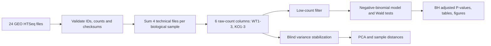
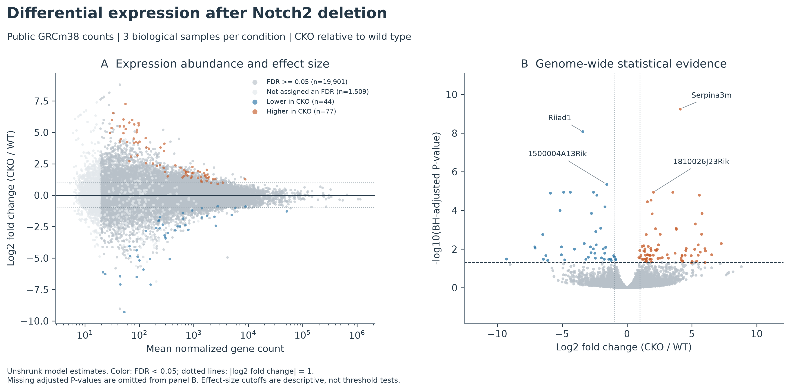
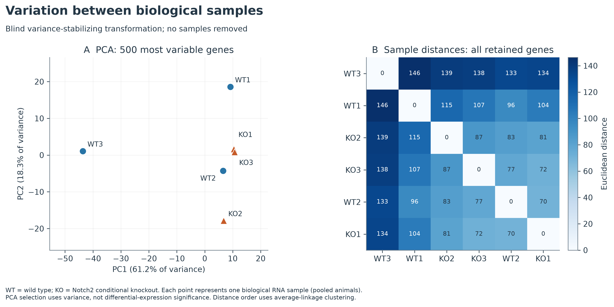
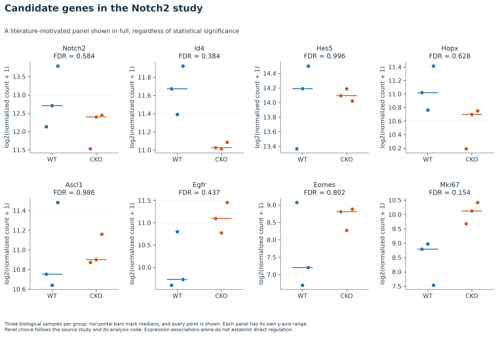

# RNA-seq analysis of Notch2 conditional knockout hippocampal stem cells

This repository records my **Genomics (BIF-211)** semester project and a reproducible reanalysis of publicly available mouse RNA-seq counts. It compares adult hippocampal neural stem-cell RNA from Notch2 conditional knockout (CKO) and wild-type mice. The original scripts, result table, and plots are retained under [`legacy/`](legacy/) and [`05_DE_analysis/`](05_DE_analysis/); the current workflow is [`scripts/analyze.py`](scripts/analyze.py).

## Course context

The original project practiced the steps of a bulk RNA-seq workflow: read quality control, trimming, alignment, gene counting, and differential-expression analysis. Some original commands contain paths from the workstation used during the semester and are preserved as a record of that work. This repository now includes a count-level analysis that another reader can run without those workstation files. The Git history remains intact; [`legacy/original_manifest.json`](legacy/original_manifest.json) maps every original path to a preserved file and its SHA-256 hash.

## Research question

Which measured genes differ in expression between Notch2 CKO and wild-type hippocampal stem-cell samples? The analysis also asks whether the sample structure and expression of genes discussed in the source study are consistent with the genome-wide result. An expression difference alone cannot establish that Notch2 directly regulates a gene.

## Dataset and experimental units

The source is NCBI GEO [GSE116773](https://www.ncbi.nlm.nih.gov/geo/query/acc.cgi?acc=GSE116773), linked to [PRJNA480214](https://www.ncbi.nlm.nih.gov/bioproject/PRJNA480214). Its original investigators sequenced **three biological RNA samples per condition**, with **two libraries and two sequencing lanes per sample**. Thus the 24 GEO count files represent six biological samples, not 24 independent replicates. The original study describes pooled animals, so these are biological RNA preparations rather than evidence about individual-mouse variation. Run accessions and the exact file-to-sample mapping appear in [`data/sample_sheet.csv`](data/sample_sheet.csv).

The current analysis uses the study-provided **GRCm38 Bowtie2/HTSeq gene-symbol counts** in [`data/source/GSE116773_RAW.tar`](data/source/GSE116773_RAW.tar). They are separate from the original project's GRCm39/Ensembl 114 HISAT2/featureCounts workflow. The original GRCm39 count matrix, FASTQ files, alignment files, and FastQC reports were not committed, so the semester result table cannot be regenerated from its original inputs here. Both sources are labeled throughout; their gene identifiers and estimates should not be compared row by row.

The related biological study is [Zhang, Boareto and colleagues, *Cell Reports* (2019)](https://doi.org/10.1016/j.celrep.2019.07.014). Its [published analysis repository](https://github.com/mboareto/Notch2KO) helped confirm that the 24 files were collapsed to WT1–WT3 and KO1–KO3. The reanalysis here is my own computational presentation of public counts, not a replication of the authors' experimental validation.

## Methods



The script rejects missing, non-integer, negative, duplicate, or mismatched source data. It retains genes with at least 10 raw counts in at least three of six biological samples, then fits `~ condition` with [PyDESeq2 0.5.2](https://pydeseq2.readthedocs.io/en/v0.5.2/auto_examples/plot_minimal_pydeseq2_pipeline.html). The reported effect is the **unshrunk** log2 fold change for CKO relative to wild type. Genome-wide calls use Benjamini–Hochberg false-discovery rate (FDR) below 0.05. A separate column notes genes that also have an observed absolute log2 fold change of at least 1; that post hoc size cutoff is descriptive and is **not** a statistical test against a twofold-change null. Approximate 95% Wald intervals are shown for a fixed literature-motivated gene panel; they are not multiplicity-adjusted intervals.

PCA uses the 500 most variable genes after a **blind** variance-stabilizing transformation. Sample distances use all retained VST genes. Neither selection uses differential-expression labels. The candidate panel contains Notch2, Id4, Hes5, Hopx, Ascl1, Egfr, Eomes, and Mki67 regardless of whether they pass FDR. Individual normalized counts and model uncertainty remain visible. A train/test split and cross-validation do not apply: this is differential-expression inference rather than predictive modeling.

## Results

The checked-in run retained **21,531 of 48,321 gene rows** after the stated count filter. Of these, **121 genes** had FDR < 0.05: **77 higher** and **44 lower** in CKO. **116** also had an observed |log2 fold change| of at least 1. A sensitivity calculation without independent filtering gave **119** FDR-significant genes. These are results from the new GRCm38 count-level analysis, not the historical GRCm39 result table. Complete values, missing-value counts, and source checksums appear in [`results/summary.json`](results/summary.json) and [`results/tables/differential_expression.csv`](results/tables/differential_expression.csv).

The first two PCA axes explain **61.2%** and **18.3%** of the variance among the selected genes. WT3 is separated from the other five samples on PC1, and condition does not cleanly explain the global pattern. **None of the eight predefined candidate genes passes genome-wide FDR < 0.05** in this reanalysis, including Id4. The plotted effect intervals are gene-wise Wald intervals and should be read alongside the genome-wide FDR values. Seven MAP dispersion fits did not converge; none of those genes is among the 121 reported FDR hits. These findings describe association in six pooled RNA preparations and do not establish a direct Notch2 regulatory mechanism.

The figures below and additional tables can be regenerated with the command below. The original GRCm39 results are labeled **historical and unverified from raw counts** in [`results/legacy_table_audit.json`](results/legacy_table_audit.json).



*MA and volcano views share the same negative-binomial model. Positive values are higher in CKO. The volcano y-axis uses adjusted P-values; gray points are not FDR-significant.*



*PCA and VST distances show each of the six biological samples, including any unusual sample rather than hiding it.*



*The eight genes were selected from the study context before inspecting their significance. Every biological sample is shown; each panel has its own y-axis.*

[Candidate-gene effects and 95% Wald intervals](results/figures/candidate_gene_effects.png) · [Top-gene heatmap](results/figures/top_gene_heatmap.png) · [Model diagnostics](results/figures/model_diagnostics.png) · [Technical-file QC](results/figures/technical_qc.png)

The preserved original table has 29,970 gene rows; 43 have original FDR below 0.05 and 29 also meet the original post hoc absolute log2 fold-change cutoff of 1. Those counts are **audited from a saved CSV**, not a successful rerun of the original analysis. The original plots used nine of ten stated runs, apparently because the first sample count column was removed during import. One original sample-distance PDF has no renderable page. The replacement analysis avoids both problems by starting with an independently traceable public count source.

## Setup and execution

Python 3.13 is used in the [automated reproducibility check](.github/workflows/reproduce.yml). On Windows, PowerShell:

```powershell
py -3.13 -m venv .venv
.venv\Scripts\python -m pip install -r requirements-dev.txt
.venv\Scripts\python -m pytest -q tests/test_data.py
.venv\Scripts\python -m scripts.analyze --out results --threads 1
.venv\Scripts\python -m pytest -q tests/test_results.py
```

On Linux or macOS, use `python3.13 -m venv .venv` and `.venv/bin/python` in the same commands. The checked-in count archive keeps the analysis itself offline. Plots are saved as PNG for GitHub viewing and as vector PDF for closer inspection. `results/summary.json` is written last, after the full calculation and every figure finishes; a failed rerun leaves `results/.running` instead of a stale success report.

## Repository map

| Location | Contents |
| --- | --- |
| [`data/source/`](data/source/) | GEO archive, source metadata excerpt, ENA run table, checksums and provenance |
| [`data/sample_sheet.csv`](data/sample_sheet.csv) | The 24 GEO files mapped to six biological samples |
| [`scripts/`](scripts/) | Input validation, statistical analysis, and figures |
| [`results/tables/`](results/tables/) | Reproduced counts, model results, QC, and figure source tables |
| [`results/figures/`](results/figures/) | Seven figure pairs, PNG and PDF |
| [`05_DE_analysis/`](05_DE_analysis/) | Original semester results and plots, retained unchanged |
| [`Converted_PDF_Images/`](Converted_PDF_Images/) | Original PNG conversions, retained unchanged |
| [`legacy/`](legacy/) | Exact original scripts and README, with file hashes and original commit |
| [`tests/`](tests/) | Source validation and output consistency checks |

## Limitations

This reanalysis begins with the authors' processed GRCm38 counts. It does not repeat read-level QC, alignment, or counting and cannot validate the original semester GRCm39 table against its missing count matrix. There are only three biological RNA preparations per condition, and pooled animals limit individual-level inference. The separated WT3 sample may influence estimates, so the PCA and sample count plots should be checked alongside gene-level results. Expression changes and literature context do not prove a direct Notch2 mechanism. The preselected candidate plots are exploratory, and the displayed Wald intervals are gene-wise rather than simultaneous confidence intervals. The original repository mentioned variant calling, but no variant workflow or VCF was present; this repository does not claim a variant result.

## What I learned

This work made the distinction between sequencing files and independent biological samples concrete. It also showed why missing intermediate data, unchecked column slicing, and mislabeled P-values can change the scientific story even when a pipeline produces attractive plots. Keeping source mapping, input checksums, raw counts, and figure data beside the result makes each claim easier to inspect.

The repository is released under the existing [MIT license](LICENSE).
